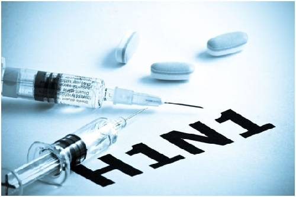

# vaccine_uptake_prediction

### 2009 h1n1_vaccine_uptake_modeling 
This study aims to predict individuals' likelihood of receiving the H1N1 flu vaccine using survey data from the National Flu Survey (NHFS, 2009). The prediction outputs will provide public health professionals and policymakers with insights into factors associated with low vaccination rates, enabling targeted interventions.

Key factors influencing vaccination status include doctor recommendation of the H1N1 vaccine, health insurance status, opinion of vaccine effectiveness, and opinion of vaccine risk. Six machine learning models were employed, with the Gradient Boosting Classifier achieving the highest accuracy and precision scores.

To accurately classify individuals who received the H1N1 flu shot, the model requires high accuracy and precision, minimizing false positives.

## Overview:
The dataset comprises responses from the 2009 NHFS National Flu Survey, encompassing 26,000 individuals. It includes information on seasonal and H1N1 flu vaccination status, along with demographic, behavioral, and health factors. The H1N1 vaccination rate was selected as the target variable. Missing values were filled using the Iterative Imputer technique.

## Methodology:
Various models were employed to identify the most accurate one. GridSearchCV was utilized to find optimal hyperparameter combinations for each model, with an emphasis on balancing class weights to address class imbalance. Performance metrics such as accuracy, precision, F1 score, and ROC-AUC curve were evaluated for each model. The ROC-AUC curves were compared to select the final model. Additionally, the confusion matrix was analyzed to minimize false positives. The Gradient Boosting Classifier emerged as the top performer in terms of accuracy and precision, hence it was chosen as the final model.

## Findings
The Gradient Boosting model emerged as the top performer among all models, displaying high scores across various metrics and effectively minimizing false positives. Notably, it demonstrated consistency between training and holdout sets, indicating robust generalization to unseen data. Feature importance analysis revealed that health-related factors and opinions, such as doctor recommendation, health insurance, and perceptions of vaccine effectiveness and risk, significantly influence vaccination behavior. This underscores the importance of addressing health-related concerns and promoting informed decision-making to improve vaccination rates.

## Conclusions
In conclusion, our analysis highlights the importance of doctor recommendations, accessibility to the vaccine regardless of health insurance status, and education about the effectiveness and risks associated with the H1N1 vaccine. These factors significantly influence vaccination rates and should be prioritized by public health officials, such as those at the American Public Health Association (APHA).

While our analysis provides valuable insights, there are limitations to consider. We acknowledge the possibility of false negatives in our predictions and recognize that other unexplored factors may also impact vaccination behavior.

## Future solutions
Moving forward, we aim to enhance our analysis by incorporating more recent flu survey data and conducting additional feature engineering to improve prediction accuracy. Additionally, we plan to extend our focus to predict seasonal flu vaccine status in future research efforts.
